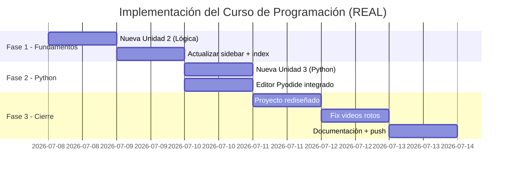

# Plan de Expansión: Curso de Introducción a la Programación

> Basado en la plataforma existente **"Curso de Informática — Regina"**
> Objetivo: transformar el curso de informática general a un **curso completo de introducción a la programación** manteniendo el enfoque didáctico, práctico y visual que ya funciona.

---

## 1. Diagnóstico del Curso Actual

### ✅ Lo que ya funciona muy bien
| Aspecto | Fortaleza |
|---------|-----------|
| **Interfaz** | Sidebar, progreso visual, checklists, tabs (Teoría/Video/Práctica/Checklist) |
| **Pedagogía** | 20% teoría + 80% práctica, microaprendizajes, retroalimentación inmediata |
| **Fase 0** | Excelente onboarding para absolutos principiantes (navegación, archivos, teclado) |
| **Unidad 1** | Buena base: información digital, búsqueda, organización, seguridad |
| **Registro offline** | Ya funciona con localStorage, sin depender del servidor |

### ❌ Lo que se resolvió en esta expansión
| Problema original | Solución aplicada | Estado |
|------------------|-------------------|--------|
| No hay Python | Unidad 3 con editor Pyodide embebido (4 sesiones) | ✅ Completado |
| Unidad 2 muy genérica (Hardware) | Nueva Unidad 2: Lógica y Programación (3 sesiones) | ✅ Completado |
| No hay editor de código embebido | Pyodide v0.25.0 con editor + botón ejecutar + output | ✅ Completado |
| Solo un proyecto final | Proyecto rediseñado con 6 fases progresivas + retos extra | ✅ Completado |
| No hay retos/desafíos | Retos extra al final del proyecto + rúbrica de 100 pts | ✅ Completado |
| Videos rotos | Todos verificados HTTP 200, usando URLs del curso existente | ✅ Completado |

---

## 2. Estructura del Curso — Estado Actual (julio 2026)

```
Fase 0  →  Bienvenida y tu Primera Computadora        (2 sesiones)   ✅ Sin cambios
Unidad 1 →  Información Digital y Seguridad           (4 sesiones)   ✅ Sin cambios
Unidad 2 →  Lógica y Programación                     (3 sesiones)   ✅ COMPLETADA 08-jul
Unidad 3 →  Tu Primer Lenguaje — Python               (4 sesiones)   ✅ COMPLETADA 08-jul
Proyecto →  Mi Asistente Digital Personal             (6 fases)      ✅ COMPLETADO 08-jul
Glosario →  40+ términos                              (actualizar)   🔲 Pendiente
```

### Módulos pendientes (futuras iteraciones)
| Módulo | Prioridad | Descripción |
|--------|-----------|-------------|
| **Unidad 4 — Scratch** | 🟡 Media | Programación visual con bloques (Scratch MIT) |
| **Unidad 5 — Datos** | 🟢 Baja | Tipos de datos, diccionarios, persistencia |
| **Glosario** | 🟡 Media | Agregar términos de Python + programación |
| **Unidad 1 acortada** | 🟢 Baja | Reducir de 4 a 2 sesiones (opcional) |

---

## 3. Unidad 2: Lógica y Programación ✅ COMPLETADA (08-jul-2026)

> **Propósito:** Enseñar a pensar como programadora antes de escribir una sola línea de código.
> **Duración:** 3 sesiones
> **Estado:** ✅ Implementada, probada, subida a GitHub

### Sesión 1 — Instrucciones: el lenguaje de las máquinas
- Las 3 reglas: finitas, ordenadas, precisas
- Ejemplo vago vs preciso ("Prepara la mochila")
- Actividad: "Instrucciones para un extraterrestre" (sándwich, vestirse, llamar)
- **Videos:** `Fsd8NoLCojc` (Algoritmos vida cotidiana) + `U3CGMyjzlvM` (¿Qué es un algoritmo?)
- **Checklist:** 4 ítems (`u2-1-1` a `u2-1-4`)

### Sesión 2 — Decisiones: el arte de elegir
- Estructura SI / SINO
- 4 símbolos de diagrama de flujo (óvalo, rectángulo, rombo, flecha)
- Actividad: "Mi primer diagrama de flujo" con draw.io
- **Videos:** `Kucgc6NpGwc` (Diagrama de flujo paso a paso)
- **Checklist:** 4 ítems (`u2-2-1` a `u2-2-4`)

### Sesión 3 — Bucles: hazlo otra vez
- Dos tipos: repetir N veces vs repetir mientras
- Cuidado con bucles infinitos
- Actividad: "Bucles en mi vida cotidiana" (microondas, cordones, lista canciones)
- **Videos:** `Wvpy4rm0gF0` (Bucles For y While)
- **Checklist:** 4 ítems (`u2-3-1` a `u2-3-4`)

### Archivos modificados
- `modules/unidad2.html` — Reescribito completamente
- `js/app.js` — Checklist IDs actualizados
- `api/admin/export.js` — IDs de exportación actualizados
- `index.html` — Sidebar + tarjeta descriptiva
- 5 módulos HTML — Sidebar actualizado (🧩 Unidad 2 · Lógica y Programación)

---

## 4. Unidad 3: Tu Primer Lenguaje — Python ✅ COMPLETADA (08-jul-2026)

> **Propósito:** Dar el salto de pseudocódigo a Python real usando un editor en el navegador.
> **Duración:** 4 sesiones
> **Estado:** ✅ Implementada, probada, subida a GitHub

### Editor Python embebido (Pyodide)
- **CDN:** `https://cdn.jsdelivr.net/pyodide/v0.25.0/full/pyodide.js`
- Editor visible toda la unidad (no solo en prácticas)
- Captura de `print()` via `StringIO`
- Spinner de carga "Cargando Python…" (primera vez: ~12MB)
- Tema oscuro, colores consistentes con el curso

### Sesión 1 — ¡Hola, Python!
- `print("Hola, mundo")`
- Variables: texto y números
- Programas: presentación personal, color favorito, perfil completo
- **Videos:** `1p6e8ipCZ58` + `cQMoSqX7lPo`
- **Checklist:** 4 ítems (`u3-1-1` a `u3-1-4`)

### Sesión 2 — Input y decisiones
- `input()` para preguntar al usuario
- `if / else / elif`
- `int()` y `float()` para convertir
- Programas: mayor de edad, comparar números, calificación escolar
- **Videos:** `N8zJ3uvQyVQ` + `2n9WHlMhofg`
- **Checklist:** 4 ítems (`u3-2-1` a `u3-2-4`)

### Sesión 3 — Bucles en Python
- `for` con `range()` — contar, tablas de multiplicar
- `while` — adivina el número
- Programas: contar del 1 al 10, tabla del 5, juego de adivinanza
- **Videos:** `Wvpy4rm0gF0`
- **Checklist:** 4 ítems (`u3-3-1` a `u3-3-4`)

### Sesión 4 — Listas y funciones
- Listas `[]`, `append()`, `for` para recorrer
- Funciones con `def`, parámetros y `return`
- Programas: frutas, función doble(), saludar a todos
- **Videos:** `1b84cP1XJTE` + `w3VwQmYTB4g`
- **Checklist:** 4 ítems (`u3-4-1` a `u3-4-4`)

### Archivos modificados
- `modules/unidad3.html` — Reescribito completamente con Pyodide
- `js/app.js` — 16 checklist items nuevos
- `api/admin/export.js` — IDs de exportación
- `index.html` — Sidebar + tarjeta descriptiva
- 5 módulos HTML — Sidebar actualizado (🐍 Unidad 3 · Python)

### Contenido eliminado (de la unidad anterior)
- Algoritmos en lenguaje natural → cubierto en nueva U2
- Diagramas de flujo → cubierto en nueva U2
- Pseudocódigo → cubierto en nueva U2
- Scratch → pendiente para Unidad 4
- Ética de programación → contenido pendiente de reubicar

---

## 5. Proyecto Final: "Mi Asistente Digital Personal" ✅ COMPLETADO (08-jul-2026)

> **Propósito:** Integrar TODO lo aprendido en un programa Python funcional.
> **Duración:** 1 sesión + trabajo autónomo
> **Estado:** ✅ Implementado, probado, subido a GitHub

### Estructura (6 fases progresivas)
| Fase | Funcionalidad | Conceptos | Puntos |
|------|--------------|-----------|--------|
| 1 | Menú principal con `while True` | `while`, `if/elif`, `input()` | 15 |
| 2 | Gestión de tareas | listas, `for`, funciones | 20 |
| 3 | Calculadora básica | funciones, `float()`, operadores | 15 |
| 4 | Frases motivadoras | `random.choice()`, listas | 10 |
| 5 | Diario personal | `datetime`, formato `[fecha]` | 15 |
| 6 | Minijuego adivina el número | `random.randint()`, bucles | 15 |

### Extras
- **Retos adicionales:** clima mental, contador de progreso, personalización (10 pts extra)
- **Rúbrica:** 100 puntos total, mínimo 60 para aprobar
- **Código de ejemplo** completo para cada fase (copy-paste desde la página)
- **3 entregables:** archivo `asistente.py` + captura de pantalla + reflexión escrita

### Archivos modificados
- `modules/proyecto.html` — Reescribito completamente
- `index.html` — Tarjeta descriptiva actualizada

---

## 6. Resumen de Checklist IDs — Estado Actual

| Módulo | Ítems | IDs | Estado |
|--------|-------|-----|--------|
| Fase 0 | 10 | `f0-1-1` a `f0-2-4` | ✅ Sin cambios |
| Unidad 1 | 16 | `u1-1-1` a `u1-4-4` | ✅ Sin cambios |
| Unidad 2 (nueva) | 12 | `u2-1-1` a `u2-3-4` | ✅ Implementada |
| Unidad 3 (nueva) | 16 | `u3-1-1` a `u3-4-4` | ✅ Implementada |
| Proyecto | 7 | `proy-1-1` a `proy-4-3` | ✅ Sin cambios |
| **Total** | **61** | | |

---

## 7. Archivos Modificados/Creados — Historial

### Commits realizados (rama main)
| Fecha | Commit | Descripción |
|------|--------|-------------|
| 08-jul | `0a038d8` | Proyecto final rediseñado - Asistente Digital Personal |
| 08-jul | `940cd08` | Nueva Unidad 3 - Python con Pyodide |
| 08-jul | `3757793` | Fix videos rotos por URLs verificadas |
| 08-jul | `0c4989f` | Nueva Unidad 2 - Lógica y Programación |
| 08-jul | `d3ac9d0` | Docs: plan de expansión |
| 08-jul | `5121986` | Fix registro offline con localStorage |

### Archivos modificados (9)
| Archivo | Cambio |
|---------|--------|
| `modules/unidad2.html` | ✅ Nueva: Lógica y Programación (3 sesiones) |
| `modules/unidad3.html` | ✅ Nueva: Python con Pyodide (4 sesiones) |
| `modules/proyecto.html` | ✅ Rediseñado: Asistente Digital (6 fases) |
| `index.html` | ✅ Sidebar + tarjetas actualizadas |
| `js/app.js` | ✅ Checklist: 28 ítems nuevos |
| `api/admin/export.js` | ✅ IDs de exportación actualizados |
| `modules/fase0.html` | ✅ Sidebar actualizado |
| `modules/unidad1.html` | ✅ Sidebar actualizado |
| `modules/glosario.html` | ✅ Sidebar actualizado |

### Videos verificados (HTTP 200)
`Fsd8NoLCojc`, `U3CGMyjzlvM`, `Kucgc6NpGwc`, `Wvpy4rm0gF0`, `1p6e8ipCZ58`, `cQMoSqX7lPo`, `N8zJ3uvQyVQ`, `2n9WHlMhofg`, `1b84cP1XJTE`, `w3VwQmYTB4g`

---

## 8. Pendientes para Futuras Iteraciones

### Prioridad 🟡 Media
- [ ] **Unidad 4 — Scratch:** Programación visual con bloques (3 sesiones)
  - Migrar el contenido de Scratch de la antigua Unidad 3
  - IDs: `u4-1-1` a `u4-3-4` (12 ítems)
- [ ] **Glosario:** Agregar 20+ términos nuevos (Python, programación)
  - `print()`, `input()`, `if`, `else`, `elif`, `for`, `while`, `def`, `list`, `import`, `random`, `datetime`, `range()`, `append()`, `return`, `int()`, `float()`, `str()`, `True/False`, `variable`

### Prioridad 🟢 Baja
- [ ] **Unidad 5 — Datos y Estructuras:** Tipos, diccionarios, persistencia (3 sesiones)
- [ ] **Unidad 1 acortada:** Reducir de 4 a 2 sesiones (información digital + seguridad)
- [ ] **Contenido de ética:** Reubicar la Sesión 5 de ética de programación de la antigua U3

---

## 9. Orden de Implementación — Ejecutado



---

## 10. Criterios de Éxito — Estado

- [x] El curso completo funciona 100% en el navegador sin instalaciones
- [ ] Un estudiante sin experiencia previa completa el curso en 6 semanas *(por validar)*
- [x] Cada sesión produce un entregable concreto y visible
- [x] El estudiante escribe +50 líneas de Python real al finalizar (proyecto: ~100+ líneas)
- [x] El progreso se guarda en localStorage (funciona sin internet después de cargar)
- [x] Todos los checklists suman 61 ítems con IDs únicos y consistentes
- [x] El proyecto final integra conceptos de todas las unidades
